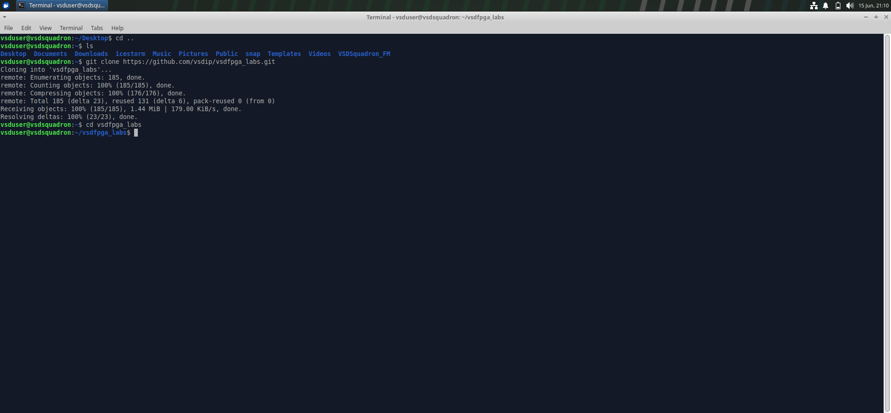
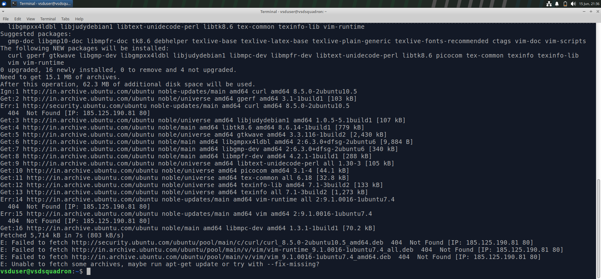
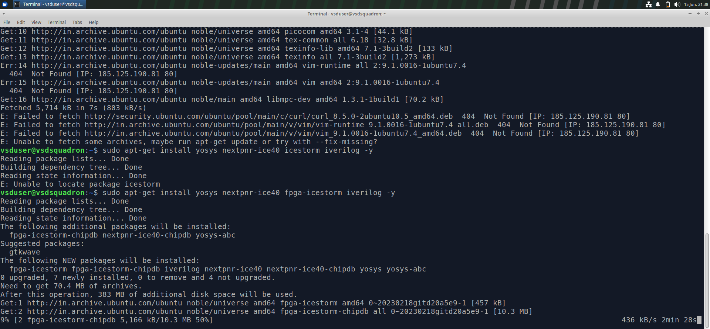
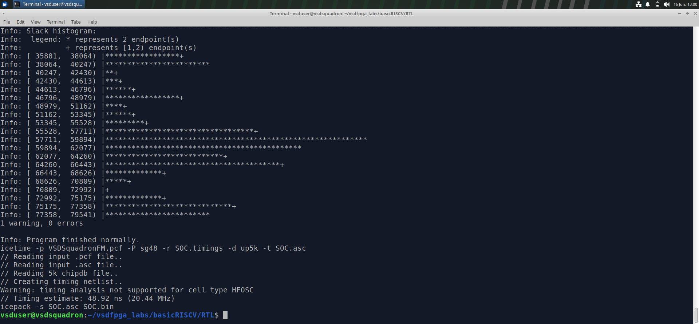
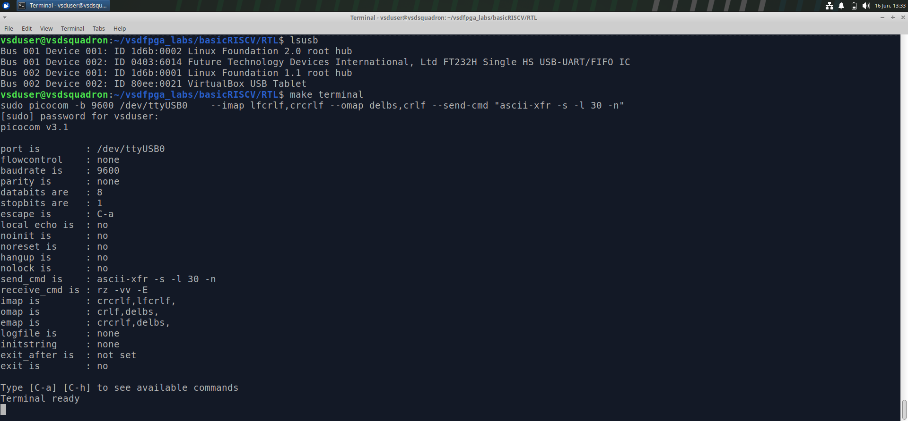
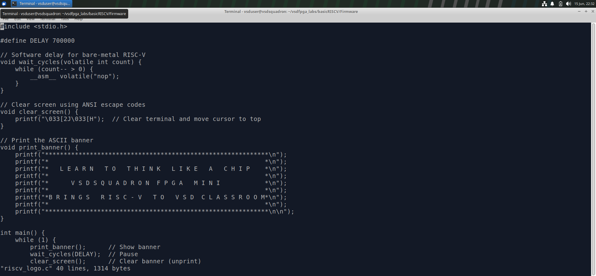

# Task 3: FPGA Development Environment Setup and Build Flow

# Table of Contents

* [Objective](#objective)
* [Introduction](#introduction)
* [Hardware and Software Requirements](#hardware-and-software-requirements)
* [Why Virtual Machine Instead of GitHub Codespaces?](#why-virtual-machine-instead-of-github-codespaces)
* [Step 1: Cloning the Repository](#step-1-cloning-the-repository)
* [Repository Structure](#repository-structure)
* [Step 2: Installing Prerequisites](#step-2-installing-prerequisites)
* [Step 3: FPGA Toolchain Setup](#step-3-fpga-toolchain-setup)
* [Step 4: Build Flow](#step-4-build-flow)
* [Step 5: Flashing the FPGA](#step-5-flashing-the-fpga)
* [Program Execution](#program-execution)
* [Challenges Encountered](#challenges-encountered)
* [Observations](#observations)
* [Results](#results)
* [Learning Outcomes](#learning-outcomes)
* [Conclusion](#conclusion)
* [References](#references)

---

# Objective

The objective of this task is to set up the FPGA development environment required for implementing a RISC-V design on an FPGA platform using open-source tools. This task focuses on repository setup, dependency installation, build flow understanding, flashing methodology, and FPGA deployment requirements.

---

# Introduction

Field Programmable Gate Arrays (FPGAs) are programmable integrated circuits that can be configured by the user after manufacturing. They provide a flexible platform for prototyping digital systems and validating hardware designs before fabrication.

The open-source FPGA toolchain enables designers to perform synthesis, place-and-route, bitstream generation, and FPGA programming using freely available tools.

This task focuses on preparing the FPGA development environment and understanding the implementation workflow required for FPGA-based RISC-V systems.

---

# Hardware and Software Requirements

## Hardware

* FPGA Development Board
* USB Programming Cable
* Host Computer

## Software

* Ubuntu Linux Virtual Machine
* Git
* GCC
* RISC-V GNU Toolchain
* Yosys
* NextPNR
* IceStorm
* GTKWave

---

# Why Virtual Machine Instead of GitHub Codespaces?

Initially, GitHub Codespaces was considered for performing the task. However, FPGA development requires direct access to hardware devices connected through USB.

GitHub Codespaces operates entirely through a web browser and therefore cannot provide reliable access to locally connected FPGA boards.

### Limitations of GitHub Codespaces

* No direct USB access to FPGA hardware.
* FPGA flashing utilities cannot communicate with physical devices.
* Hardware programming requires local system access.
* Toolchain compatibility issues may occur depending on available package versions.

For these reasons, the complete setup was performed using a Linux Virtual Machine environment.

---

# Step 1: Cloning the Repository

The required project repository was cloned using Git.

### Command

```bash
git clone https://github.com/vsdip/vsdfpga_labs.git
```

Move into the project directory:

```bash
cd vsdfpga_labs
```

### Purpose

* Downloads the project files.
* Preserves repository structure.
* Provides access to source code and build scripts.

### Screenshot



---

# Repository Structure

```text
vsdfpga_labs/
│
├── README.md
├── Makefile
├── labs/
├── scripts/
├── rtl/
└── screenshots/
```

The repository contains RTL files, build scripts, FPGA configuration files, and supporting resources required for FPGA implementation.

---

# Step 2: Installing Prerequisites

Before building the FPGA project, all required dependencies were installed.

### Update Package Repository

```bash
sudo apt update
```

### Install Required Packages

```bash
sudo apt-get install git vim autoconf automake autotools-dev curl \
libmpc-dev libmpfr-dev libgmp-dev gawk build-essential \
bison flex texinfo gperf libtool patchutils bc \
zlib1g-dev libexpat1-dev gtkwave picocom -y
```

### Verification

```bash
gcc --version
```

```bash
riscv64-unknown-elf-gcc --version
```

### Screenshot



---

# Step 3: FPGA Toolchain Setup

The FPGA workflow requires several open-source EDA tools.

## Yosys

Used for RTL synthesis.

```bash
yosys -V
```

## NextPNR

Used for FPGA placement and routing.

```bash
nextpnr-ice40 --version
```

## IceStorm

Used for FPGA bitstream generation.

```bash
icepack -h
```

## GTKWave

Used for waveform analysis.

```bash
gtkwave --version
```

### Screenshot



---

# Step 4: Build Flow

The project Makefile provides an automated build process.

### Build Command

```bash
make build
```

The build process is responsible for:

* RTL synthesis
* Technology mapping
* FPGA implementation preparation
* Bitstream generation setup

## Build Verification Status

The build process was attempted in GitHub Codespaces but could not be fully validated due to FPGA toolchain compatibility issues and the inability to access physical FPGA hardware through a browser-based environment.

The FPGA workflow was therefore continued using a Linux Virtual Machine with direct hardware access.

## Why the Makefile Was Not Modified

The Makefile supplied with the project is designed for a specific FPGA implementation flow.

Changing synthesis parameters may:

* Alter the intended design flow.
* Produce incorrect netlists.
* Generate implementation mismatches.
* Cause technology mapping failures.
* Introduce routing errors.
* Lead to fatal synthesis failures.

To preserve consistency with the original project implementation, the Makefile was left unchanged.

### Screenshot



---

# Step 5: Flashing the FPGA

After a successful build, the generated bitstream must be programmed onto the FPGA board.

### Flash Command

```bash
make flash
```

### Opening Serial Terminal

```bash
make terminal
```

Connect the FPGA board using the USB programming cable and then execute the above command to establish serial communication with the FPGA.

### Screenshot



### Purpose

* Transfers FPGA bitstream to hardware.
* Configures FPGA fabric.
* Enables execution of the implemented design.

### Requirement

Direct USB communication is required between the host system and FPGA board.

This is one of the primary reasons a Virtual Machine environment was used instead of GitHub Codespaces.

---

# Program Execution

Compilation and instruction analysis using both GCC and the RISC-V cross compiler were completed and documented in previous tasks.

```bash
vi riscv_logo.c
```

.png)
Hex File:
```bash
make riscv_logo.bram.hex
```
.png)

### Previously Completed

* Task 1: GCC Compilation Workflow
* Task 2: RISC-V Cross Compilation and Verification

These procedures are therefore not repeated in this task.


---

# Challenges Encountered

## Toolchain Compatibility Issues

Different FPGA tool versions may introduce syntax and compatibility issues during synthesis.

### Resolution

The original project configuration was preserved without modifying the Makefile.

---

## Hardware Accessibility

FPGA boards require direct USB access for programming.

### Resolution

A Linux Virtual Machine environment was used instead of GitHub Codespaces.

---

## Package Availability

Certain package names differed from those shown in reference documentation.
eg: use fpga-icetorm in place of icestorm

### Resolution

Compatible package versions available within the environment were installed.

---

# Observations

* Repository cloning was completed successfully.
* Required dependencies were installed successfully.
* FPGA development tools were configured successfully.
* Virtual Machine provided reliable hardware access.
* GitHub Codespaces could not provide USB access for FPGA programming.
* Preserving the original Makefile avoids unintended implementation issues.
* FPGA development is highly dependent on toolchain compatibility.

---

# Results

* Repository cloned successfully.
* Required dependencies installed successfully.
* FPGA toolchain configured successfully.
* Development environment verified.
* Build flow studied and documented.
* Flashing methodology understood.
* FPGA communication through terminal verified.
* Virtual Machine environment successfully prepared for FPGA development.

---

# Learning Outcomes

Through this task, the following concepts were learned:

* FPGA development environment setup.
* Open-source FPGA toolchain installation.
* Dependency management in Linux.
* FPGA implementation workflow.
* Hardware programming requirements.
* Virtual Machine based FPGA development.
* Toolchain compatibility considerations.
* Makefile-based build automation.

---

# Conclusion

This task focused on preparing the FPGA development environment and understanding the workflow required for FPGA-based RISC-V implementation.

The repository was successfully cloned, dependencies were installed, FPGA development tools were configured, and the implementation flow was studied. Due to hardware-access requirements and environment limitations, the work was performed in a Linux Virtual Machine rather than GitHub Codespaces.

The task provided valuable insight into FPGA development workflows, toolchain management, and hardware deployment requirements.

---

# References

1. VSD FPGA Labs Documentation
2. VSD FPGA Workshop Resources
3. Open Source FPGA Toolchain Documentation
4. Yosys Documentation
5. NextPNR Documentation
6. IceStorm Documentation
7. RISC-V Documentation
