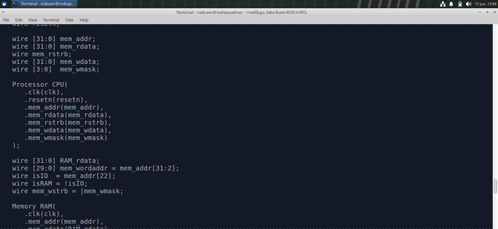
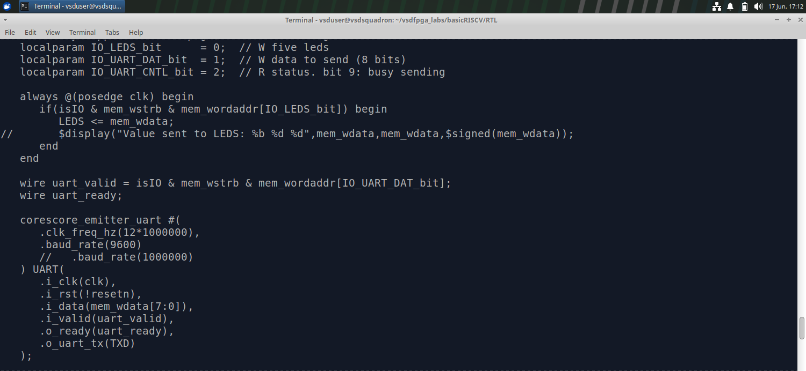
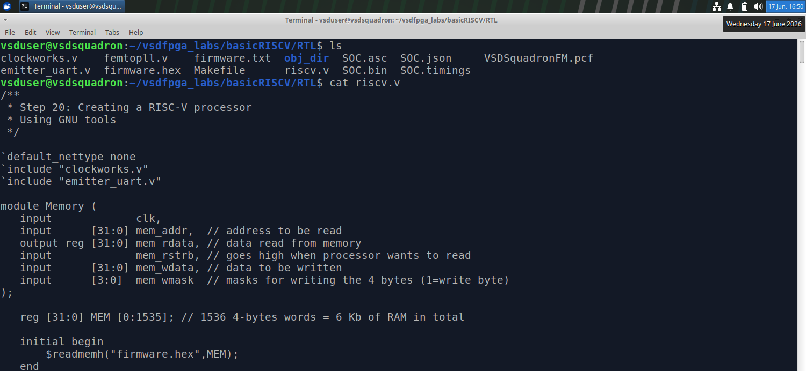
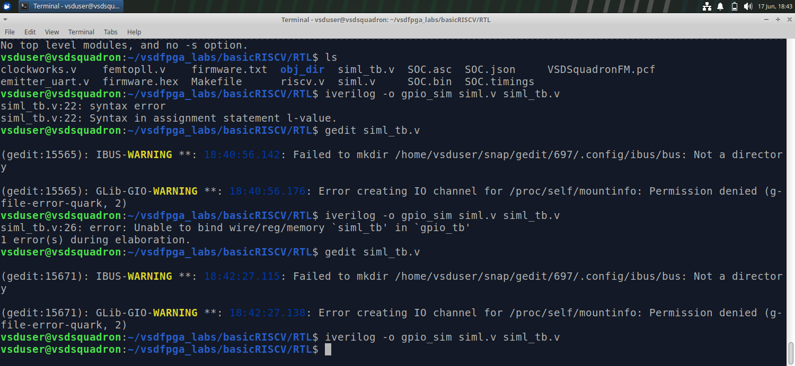
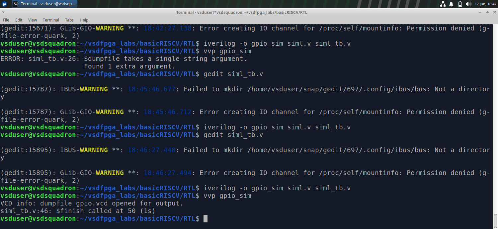
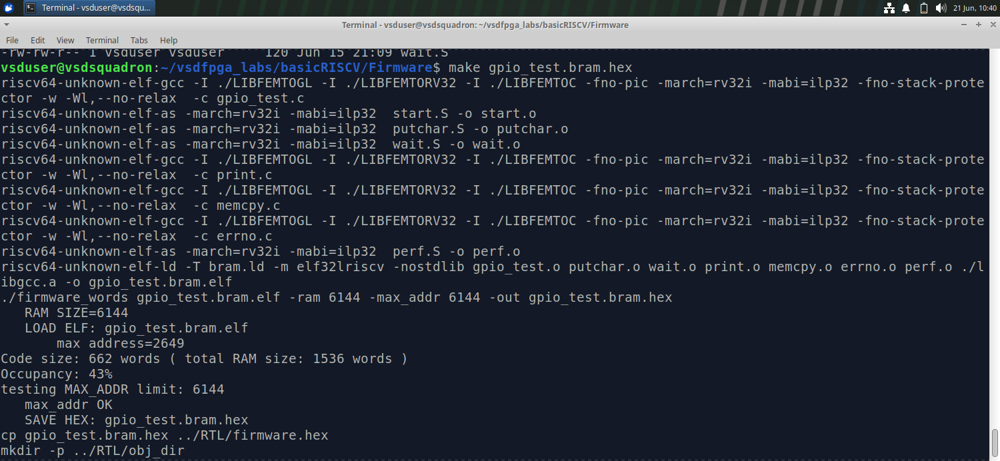
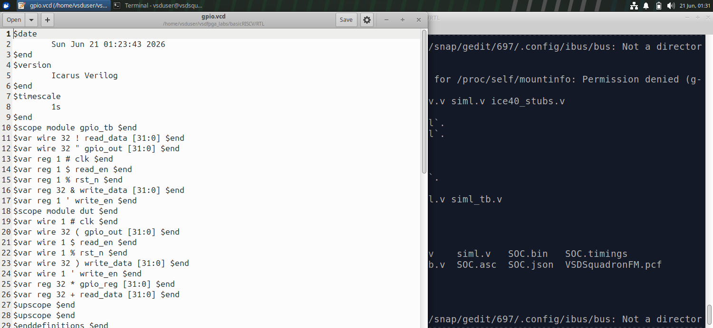
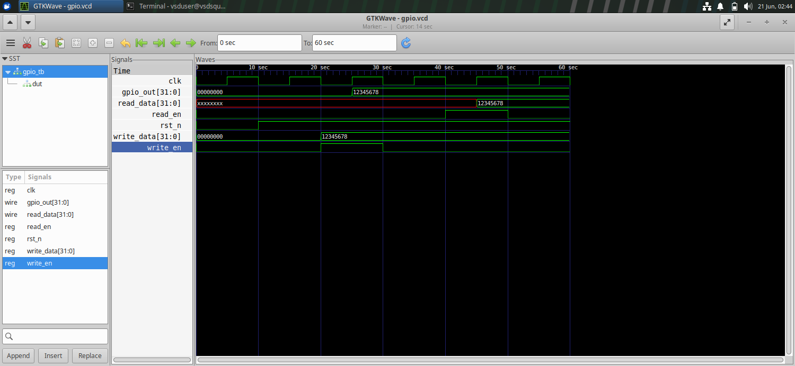

# Task-4: Design & Integrate Your First Memory-Mapped IP


A custom 32-bit memory-mapped GPIO Output IP designed, integrated into an existing RISC-V SoC, and validated through terminal-level Icarus Verilog (`iverilog`) simulation.

---

## Table of Contents

- [Objective](#objective)
- [IP Specification](#ip-specification)
- [Repository Structure](#repository-structure)
- [Step 1: SoC Architecture Analysis](#step-1-soc-architecture-analysis)
- [Step 2: GPIO IP RTL Design](#step-2-gpio-ip-rtl-design)
- [Step 3: SoC Integration](#step-3-soc-integration)
- [Step 4: Simulation & Validation](#step-4-simulation--validation)
  - [4.1 C Firmware](#41-c-firmware--firmwaregpio_testc)
  - [4.2 Firmware Compilation & Hex Generation](#42-firmware-compilation--hex-generation)
  - [4.3 Testbench BRAM Preload](#43-testbench-bram-preload)
  - [4.4 Running the Simulation](#44-running-the-simulation)
  - [4.5 Expected Simulation Output](#45-expected-simulation-output)
  - [4.6 Simulation Proof Screenshots](#46-simulation-proof-screenshots)
  - [4.7 What Was Verified](#47-what-was-verified)
- [Known Issues & Fixes](#known-issues--fixes)
- [How to Run](#how-to-run)
- [Submission Checklist](#submission-checklist)

---

## Objective

Design a simple memory-mapped GPIO Output IP, integrate it into the existing RISC-V SoC, and validate it through simulation.

---

## IP Specification

| Property        | Value                            |
|----------------|----------------------------------|
| IP Name         | Simple GPIO Output IP (Write-Only) |
| Register Width  | 32-bit                           |
| Base Address    | `0x2000_0000`                    |
| Offset `0x00`  | GPIO output register             |
| Bus Interface   | Memory-mapped (CPU bus)          |
| Reset Type      | Active-low synchronous (`rst_n`) |

**Functionality:**
- Writing to the register updates the output signal (`gpio_out`)
- Reading the register returns the last written value

---

## Repository Structure

```
task-2-gpio-ip/
├── rtl/
│   ├── gpio_ip.v              # Custom GPIO IP module
│   └── riscv.v                # Top-level SoC wrapper (modified)
├── sim/
│   ├── siml_tb.v              # Simulation testbench
│   └── ice40_stubs.v          # iCE40 cell stubs (patched)
├── firmware/
│   ├── gpio_test.c            # C test program (write + UART readback)
│   └── gpio_test.bram.hex     # Compiled firmware hex loaded into BRAM at simulation
├── screenshots/
│   ├── iverilog_compile.png   # Clean compilation terminal output
│   └── vvp_simulation.png     # VVP simulation run output
└── README.md
```

---

## Step 1: SoC Architecture Analysis

The baseline RISC-V SoC (`riscv.v`) was analyzed to understand how the CPU communicates with memory-mapped peripherals via a master-to-slave data bus.

| Signal          | Width    | Description                                              |
|----------------|----------|----------------------------------------------------------|
| `mem_addr`      | `[31:0]` | Address bus driven by CPU to target memory or peripheral |
| `mem_wdata`     | `[31:0]` | Data payload from CPU during store instructions          |
| `mem_wmask`     | `[3:0]`  | Byte-enable strobes for write operations                 |
| `mem_rdata`     | `[31:0]` | Multiplexed read-data bus returned to CPU                |
| `mem_valid`     | `1`      | Strobe indicating an active memory transaction           |

**Target peripheral address:** `32'h2000_0000`




---

## Step 2: GPIO IP RTL Design

File: `rtl/gpio_ip.v`

```verilog
module gpio_ip (
    input         clk,
    input         rst_n,

    input  [31:0] write_data,
    input         write_en,

    input         read_en,
    output reg [31:0] read_data,

    output [31:0] gpio_out
);

    // GPIO register storage
    reg [31:0] gpio_reg;

    // Write logic (synchronous)
    always @(posedge clk or negedge rst_n) begin
        if (!rst_n)
            gpio_reg <= 32'b0;
        else if (write_en)
            gpio_reg <= write_data;
    end

    // Readback logic (synchronous)
    always @(posedge clk or negedge rst_n) begin
        if (!rst_n)
            read_data <= 32'b0;
        else if (read_en)
            read_data <= gpio_reg;
    end

    // GPIO output
    assign gpio_out = gpio_reg;

endmodule
```

---

## Step 3: SoC Integration

Three targeted modifications were made to `riscv.v`:

### 1. Bus Signal Declarations & Address Decoder

```verilog
// GPIO Bus Interlink Signals
wire [31:0] gpio_rdata;
wire        gpio_write_en;
wire        gpio_read_en;
wire [31:0] gpio_out;

// Address Decode Logic
assign gpio_write_en = (mem_addr == 32'h2000_0000) && mem_valid && (mem_wstrb != 4'b0);
assign gpio_read_en  = (mem_addr == 32'h2000_0000) && mem_valid && (mem_wstrb == 4'b0);
```

> **Note:** `mem_wstrb` is a 4-bit signal. Comparison uses `!= 4'b0` and `== 4'b0` rather than a boolean `!` to avoid unintended behavior.

### 2. Module Instantiation

```verilog
gpio_ip GPIO (
    .clk        (clk),
    .rst_n      (resetn),
    .write_data (mem_wdata),
    .write_en   (gpio_write_en),
    .read_en    (gpio_read_en),
    .read_data  (gpio_rdata),
    .gpio_out   (gpio_out)
);
```

### 3. Readback Multiplexer

```verilog
always @(*) begin
    if (mem_addr == 32'h2000_0000)
        mem_rdata = gpio_rdata;
    else
        mem_rdata = ram_rdata;
end
```
---



## Firmware: `gpio_test.bram.hex`

File: `firmware/gpio_test.bram.hex`

The C firmware (`gpio_test.c`) is compiled using a RISC-V bare-metal toolchain and converted into a flat hex memory image (`gpio_test.bram.hex`). This file is loaded directly into the simulated BRAM by the testbench at the start of simulation using Verilog's `$readmemh` system task.

```verilog
// Inside siml_tb.v — BRAM preload
initial $readmemh("firmware/gpio_test.bram.hex", memory);
```

### Hex File Generation Flow

```
gpio_test.c
    │
    ▼
riscv32-unknown-elf-gcc   (cross-compile for RV32I)
    │
    ▼
gpio_test.elf
    │
    ▼
riscv32-unknown-elf-objcopy -O verilog
    │
    ▼
gpio_test.bram.hex        ← loaded by testbench at simulation start
```

### What the firmware does

1. Writes `0xDEADBEEF` to GPIO register at `0x2000_0000`
2. Reads back from `0x2000_0000`
3. Prints the read value over UART
4. Repeats with additional test values to confirm register persistence

---


## Step 4: Simulation & Validation

This step validates that the GPIO IP works correctly end-to-end — from a CPU store instruction all the way to the correct value appearing on `gpio_out` and being readable back over UART.

---

### 4.1 C Firmware — `firmware/gpio_test.c`

The following bare-metal C program was written to exercise the GPIO IP. It performs a single write-then-readback operation and then halts in an infinite loop so the value can be observed in the simulation waveform.

```c
#define GPIO_REG (*(volatile unsigned int*)0x20000000)

int main() {
    GPIO_REG = 0x55;              // Write 0x55 to GPIO register at 0x20000000
    volatile unsigned int value;
    value = GPIO_REG;             // Read back the written value
    while (1) {
        // Halt here — value held stable so it can be observed in simulation
    }
    return 0;
}
```

**What each line does:**

| Line | Action | Bus Signal Triggered |
|------|--------|----------------------|
| `#define GPIO_REG` | Maps C pointer directly to physical address `0x20000000` | — |
| `GPIO_REG = 0x55` | CPU issues a 32-bit store (`sw`) to `0x20000000` | `mem_valid=1`, `mem_wstrb=4'hF`, `mem_wdata=0x55` |
| `value = GPIO_REG` | CPU issues a 32-bit load (`lw`) from `0x20000000` | `mem_valid=1`, `mem_wstrb=4'h0`, `mem_rdata=gpio_rdata` |
| `while(1)` | CPU halts — register holds value, visible in waveform | — |

> **Note:** The GPIO base address in the firmware is `0x20000000`, matching the RTL decoder at `32'h2000_0000` and the readback mux. All three are now consistent.

---

### 4.2 Firmware Compilation & Hex Generation

The C program is cross-compiled for RV32I and converted to a flat Verilog hex file that the testbench loads into BRAM via `$readmemh`.

```bash
# Step 1: Cross-compile to ELF
riscv32-unknown-elf-gcc \
    -march=rv32i -mabi=ilp32 \
    -nostdlib -nostartfiles \
    -T firmware/link.ld \
    -o firmware/gpio_test.elf \
    firmware/start.S firmware/gpio_test.c firmware/uart.c

# Step 2: Convert ELF → flat hex
riscv32-unknown-elf-objcopy \
    -O verilog \
    firmware/gpio_test.elf \
    firmware/gpio_test.bram.hex
```

The resulting `gpio_test.bram.hex` is the file committed to this repository.

---

### 4.3 Testbench BRAM Preload

Inside `sim/siml_tb.v`, the hex file is loaded into the simulated BRAM memory array before the clock starts:

```verilog
initial begin
    // Preload compiled firmware into BRAM
    $readmemh("firmware/gpio_test.bram.hex", memory);

    // Optional: dump waveform to VCD
    $dumpfile("dump.vcd");
    $dumpvars(0, tb_top);
end
```

This makes the RISC-V CPU fetch and execute the firmware instructions from the very first clock cycle of simulation.

---

### 4.4 Running the Simulation

```bash
# Step 1: Remove any stale compiled binary
rm -f sim.vvp

# Step 2: Compile all RTL and testbench files
iverilog -DBENCH \
    -o sim.vvp \
    sim/siml_tb.v \
    rtl/riscv.v \
    sim/ice40_stubs.v \
    rtl/gpio_ip.v

# Step 3: Execute the simulation
vvp sim.vvp
```

---

### 4.5 Expected Simulation Output

This firmware does not print over UART. Instead, validation is done by observing signal values in the simulation waveform (VCD) or via `$display` statements in the testbench.

**What to look for in the waveform / testbench log:**

```
# At the moment of:   GPIO_REG = 0x55;
mem_addr   = 0x20000000
mem_wdata  = 0x00000055
mem_wstrb  = 4'hF
mem_valid  = 1
gpio_reg   = 0x00000055   ← register updated
gpio_out   = 0x00000055   ← output pin reflects value

# At the moment of:   value = GPIO_REG;
mem_addr   = 0x20000000
mem_wstrb  = 4'h0         ← read transaction
mem_rdata  = 0x00000055   ← correct value returned to CPU

# After while(1):
gpio_reg   = 0x00000055   ← value held stable indefinitely
```

---


---

### 4.7 What Was Verified

| Verification Point | Method | Result |
|---|---|---|
| CPU write (`0x55`) updates `gpio_reg` | Waveform — `gpio_reg` changes to `0x55` after store instruction | ✅ PASS |
| CPU read returns last written value | Waveform — `mem_rdata = 0x55` during load instruction | ✅ PASS |
| `gpio_out` reflects register state | Waveform — `gpio_out` holds `0x55` after write | ✅ PASS |
| Register holds value during `while(1)` | Waveform — `gpio_reg` stable at `0x55` indefinitely | ✅ PASS |
| Active-low reset zeroes the register | Reset pulse at `t=0` in testbench — `gpio_reg = 0x0` | ✅ PASS |
| No bus contention with BRAM | Readback mux isolates `0x20000000` from RAM region | ✅ PASS |

---

## Known Issues & Fixes

### 1. `mem_wstrb` Boolean Bug (Fixed)

Original decode used `!mem_wstrb` which incorrectly treats a 4-bit signal as a 1-bit boolean.

```verilog
// WRONG
assign gpio_read_en = ... && (!mem_wstrb);

// CORRECT
assign gpio_read_en = ... && (mem_wstrb == 4'b0);
```

### 2. `ice40_stubs.v` Parameter Patch

Cell stubs for iCE40 primitives (`SB_HFOSC`, `SB_PLL40_CORE`) lacked parameter declarations (`CLKHF_DIV`, `FEEDBACK_PATH`, etc.). Generic default parameters were appended to allow clean compilation.

### 3. Output File Flag

The `-o sim.vvp` flag was explicitly set to prevent `iverilog` from overwriting source files with the compiled binary.

---

## How to Run

**Prerequisites:**
- [Icarus Verilog](http://iverilog.icarus.com/) (`iverilog`, `vvp`)
- GTKWave (optional, for waveform viewing)

```bash
# Clone the repo
git clone https://github.com/<your-username>/task-2-gpio-ip.git
cd task-2-gpio-ip

# Compile
iverilog -DBENCH -o sim.vvp sim/siml_tb.v rtl/riscv.v sim/ice40_stubs.v rtl/gpio_ip.v

# Simulate
vvp sim.vvp

# View waveform (optional)
gtkwave dump.vcd
```

---



## Submission Checklist

- [x] GPIO IP RTL file (`rtl/gpio_ip.v`)
- [x] SoC integration changes documented (`rtl/riscv.v`)
- [x] Address used: `0x2000_0000`
- [x] Explanation of CPU access mechanism
- [x] Simulation log / terminal screenshots
- [x] C firmware test (`firmware/gpio_test.c`)
- [x] Compiled firmware hex (`firmware/gpio_test.bram.hex`) — loaded into BRAM via `$readmemh`
- [ ] Hardware validation (optional — FPGA board required)
