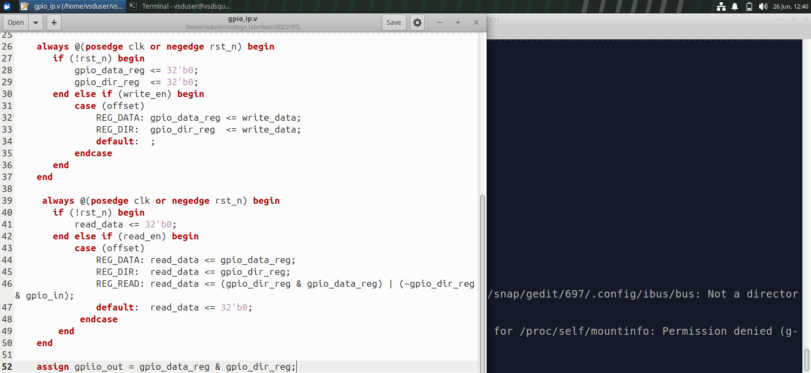
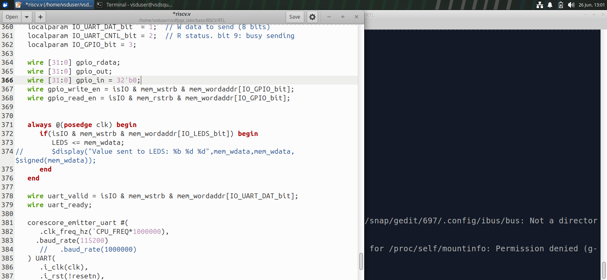
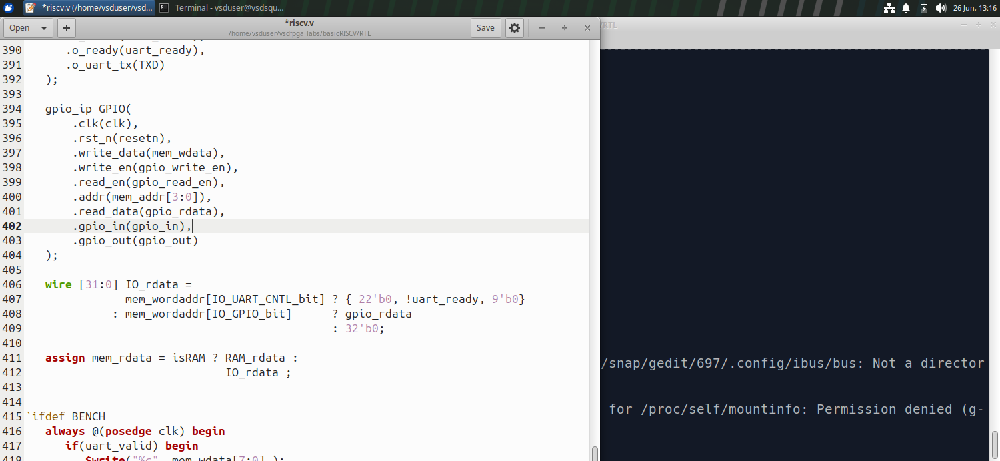
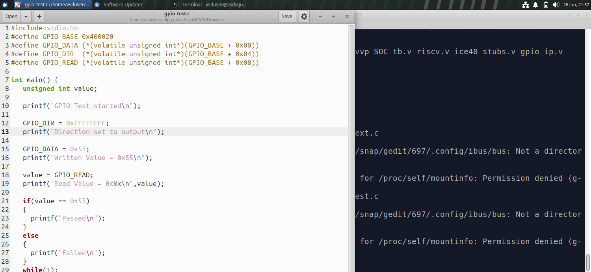
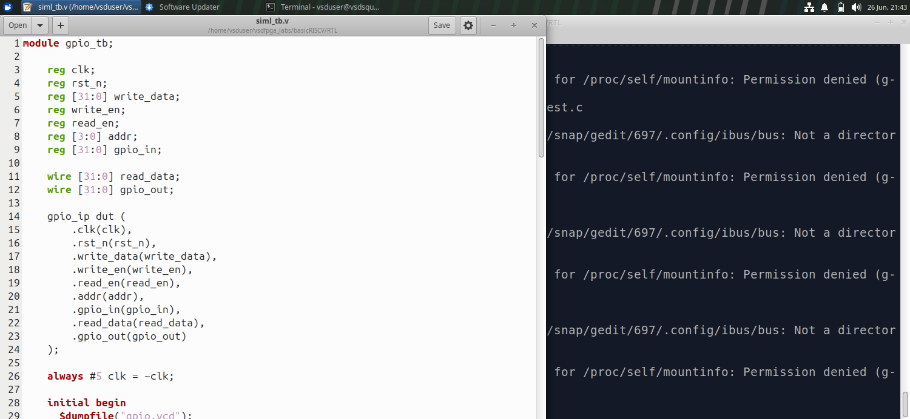
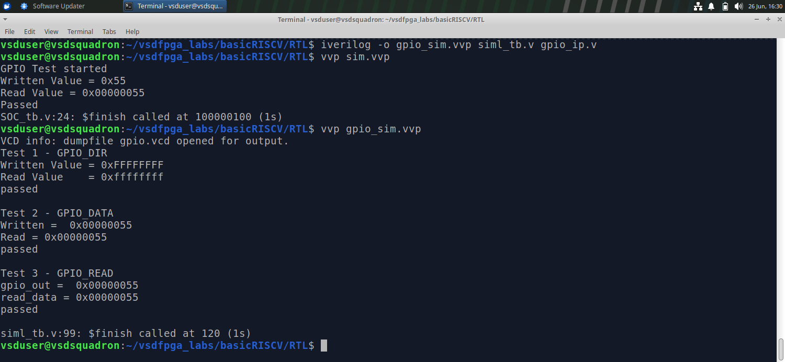
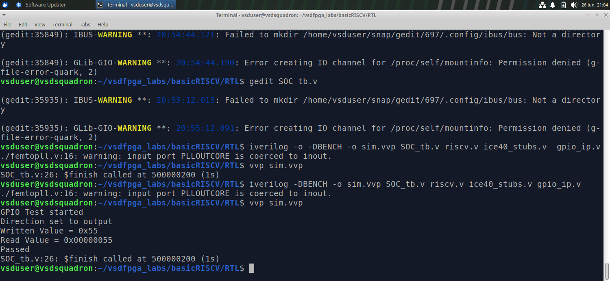
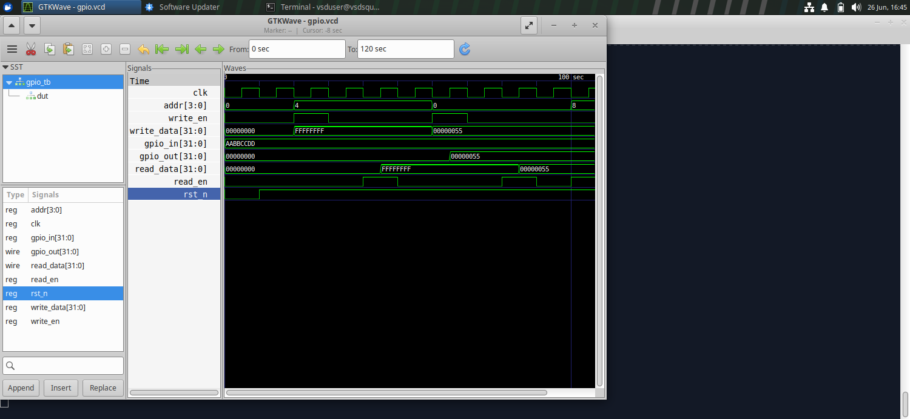
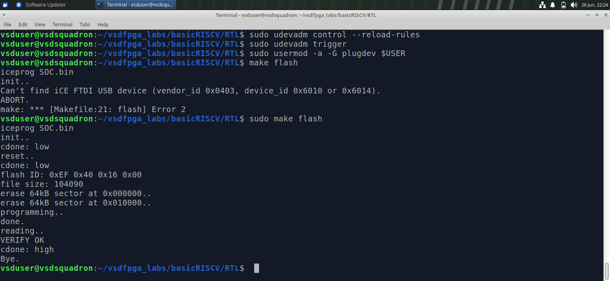
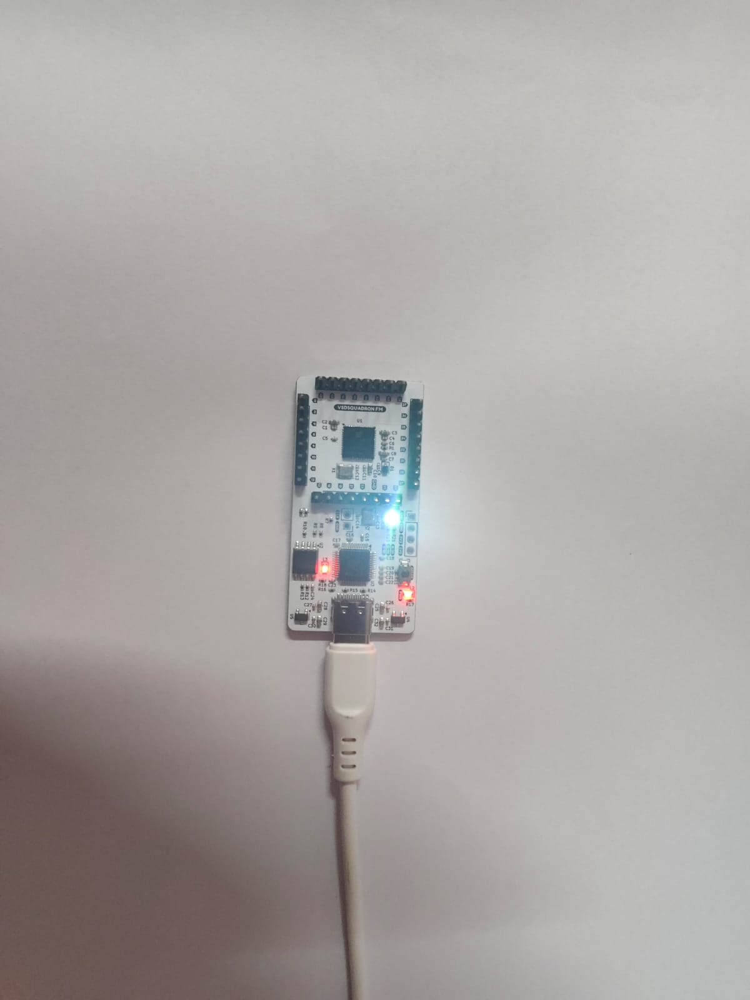

# Task-5: Multi-Register GPIO IP with Software Control


---

## Table of Contents
- [Objective](#objective)
- [Register Map](#register-map)
- [Step 1: Study and Plan](#step-1-study-and-plan)
- [Step 2: RTL Implementation](#step-2-rtl-implementation)
- [Step 3: SoC Integration](#step-3-soc-integration)
- [Step 4: Software Validation](#step-4-software-validation)
- [Step 5: Hardware Validation](#step-5-hardware-validation-optional)
- [Address Decoding Explanation](#address-decoding-explanation)
- [Direction Control Explanation](#direction-control-explanation)
- [Files](#files)

---

## Objective

Extend the simple GPIO IP from Task-2 into a realistic, multi-register, software-controlled IP similar to what exists in production SoCs.

This task focuses on:
- Designing a proper register map
- Handling multiple registers inside one IP
- Strengthening understanding of memory-mapped I/O
- Validating end-to-end control from software to hardware

---

## Register Map

| Offset | Register Name | Description                          | Access |
|--------|---------------|--------------------------------------|--------|
| 0x00   | GPIO_DATA     | GPIO output data register            | R/W    |
| 0x04   | GPIO_DIR      | Direction register (1=out, 0=in)     | R/W    |
| 0x08   | GPIO_READ     | Readback register (current pin state)| R      |

**Base Address:** `0x400020` (reused from Task-2)

---

## Step 1: Study and Plan

### Task-2 GPIO IP Review
- Single register GPIO IP implemented
- Supported write and readback
- Integrated into RISC-V SOC at base address `0x400020`

### Plan for Task-3
- Extend to 3 registers: `GPIO_DATA`, `GPIO_DIR`, `GPIO_READ`
- Add address offset decoding using `addr[3:2]` bits inside the IP
- Add direction control logic — each bit controls one GPIO pin
- Update SOC integration to pass address offset

### Internal Signals Planned
| Signal | Width | Purpose |
|--------|-------|---------|
| `gpio_data_reg` | 32-bit | Stores written output data |
| `gpio_dir_reg`  | 32-bit | Stores direction per bit |
| `gpio_read_reg` | 32-bit | Reflects current pin state |
| `offset`        | 2-bit  | Selects which register |


---

## Step 2: RTL Implementation

### Key Design Decisions
- Base address reused from Task-2: `0x400020`
- Offset decoded using `addr[3:2]`:
  - `2'b00` → GPIO_DATA
  - `2'b01` → GPIO_DIR
  - `2'b10` → GPIO_READ
- Synchronous logic throughout — no latches
- Direction register controls output enable per bit

### gpio_ip.v Code

```verilog
module gpio_ip (
    input  wire        clk,
    input  wire        rst_n,

    // Bus interface
    input  wire [31:0] write_data,
    input  wire        write_en,
    input  wire        read_en,
    input  wire [3:0]  addr,        // address offset

    output reg  [31:0] read_data,

    // GPIO signals
    input  wire [31:0] gpio_in,     // physical input pins
    output wire [31:0] gpio_out     // physical output pins
);

    // Internal registers
    reg [31:0] gpio_data_reg;   // 0x00 - output data
    reg [31:0] gpio_dir_reg;    // 0x04 - direction (1=out, 0=in)

    // offset decode using addr[3:2]
    localparam REG_DATA = 2'b00;  // offset 0x00
    localparam REG_DIR  = 2'b01;  // offset 0x04
    localparam REG_READ = 2'b10;  // offset 0x08

    wire [1:0] offset = addr[3:2];

    // Write logic
    always @(posedge clk or negedge rst_n) begin
        if (!rst_n) begin
            gpio_data_reg <= 32'b0;
            gpio_dir_reg  <= 32'b0;
        end else if (write_en) begin
            case (offset)
                REG_DATA: gpio_data_reg <= write_data;
                REG_DIR:  gpio_dir_reg  <= write_data;
                default:  ; // READ register is read-only
            endcase
        end
    end

    // Read logic
    always @(posedge clk or negedge rst_n) begin
        if (!rst_n) begin
            read_data <= 32'b0;
        end else if (read_en) begin
            case (offset)
                REG_DATA: read_data <= gpio_data_reg;
                REG_DIR:  read_data <= gpio_dir_reg;
                REG_READ: read_data <= (gpio_dir_reg & gpio_data_reg) |
                                       (~gpio_dir_reg & gpio_in);
                default:  read_data <= 32'b0;
            endcase
        end
    end

    // Output: only drive pins configured as output
    assign gpio_out = gpio_data_reg & gpio_dir_reg;

endmodule
```

<!-- SCREENSHOT_2: Add screenshot of your gpio_ip.v in editor here -->


### Register Behavior

**GPIO_DATA (offset 0x00)**
- Write → updates `gpio_data_reg`
- Read → returns last written value

**GPIO_DIR (offset 0x04)**
- Write → updates `gpio_dir_reg`
- Each bit: `1` = output, `0` = input
- Read → returns current direction register

**GPIO_READ (offset 0x08)**
- Read only
- Returns current GPIO pin state
- For output pins → reflects driven value
- For input pins → reflects pin input

---

## Step 3: SoC Integration

### Changes Made to riscv.v
- Updated `gpio_ip` instantiation to pass address offset
- Address decoding routes accesses correctly to GPIO base
- GPIO signals exposed at top module level

### Integration Code

#### GPIO wires added in riscv.v:
```verilog
wire [31:0] gpio_rdata;
wire [31:0] gpio_out;
wire [31:0] gpio_in = 32'b0;  // tied to 0 for simulation
wire gpio_write_en = isIO & mem_wstrb & mem_wordaddr[IO_GPIO_bit];
wire gpio_read_en  = isIO & mem_rstrb & mem_wordaddr[IO_GPIO_bit];
```

#### GPIO IP instantiation in riscv.v:
```verilog
gpio_ip GPIO(
    .clk(clk),
    .rst_n(resetn),
    .write_data(mem_wdata),
    .write_en(gpio_write_en),
    .read_en(gpio_read_en),
    .addr(mem_addr[3:0]),
    .read_data(gpio_rdata),
    .gpio_in(gpio_in),
    .gpio_out(gpio_out)
);
```

#### IO_rdata mux updated:
```verilog
wire [31:0] IO_rdata =
    mem_wordaddr[IO_UART_CNTL_bit] ? {22'b0, !uart_ready, 9'b0}
  : mem_wordaddr[IO_GPIO_bit]      ? gpio_rdata
                                   : 32'b0;
```

#### localparam added:
```verilog
localparam IO_GPIO_bit = 3;  // GPIO IP select bit
```

<!-- SCREENSHOT_3: Add SOC integration code screenshot here -->



---

## Step 4: Software Validation

### C Program (gpio_test.c)

```c
#include<stdio.h>

#define GPIO_BASE    (0x400020)
#define GPIO_DATA    (*(volatile unsigned int*)(GPIO_BASE + 0x00))
#define GPIO_DIR     (*(volatile unsigned int*)(GPIO_BASE + 0x04))
#define GPIO_READ    (*(volatile unsigned int*)(GPIO_BASE + 0x08))

int main() {
    unsigned int value;

    printf("GPIO Test started\n");

    // Step 1: Set direction to output
    GPIO_DIR = 0xFFFFFFFF;
    printf("Direction set to output\n");

    // Step 2: Write value
    GPIO_DATA = 0x55;
    printf("Written Value = 0x55\n");

    // Step 3: Read back
    value = GPIO_READ;
    printf("Read Value = 0x%x\n", value);

    // Step 4: Verify
    if(value == 0x55)
        printf("Passed\n");
    else
        printf("Failed\n");

    while(1);
    return 0;
}
```

<!-- SCREENSHOT_4: Add gpio_test.c screenshot here -->


### What the C Program Does
1. Sets GPIO direction (all outputs) via `GPIO_DIR`
2. Writes `0x55` to `GPIO_DATA`
3. Reads back from `GPIO_READ`
4. Prints results via UART
5. Prints Passed/Failed

### siml_tb.v Testbench Code

```verilog
module gpio_tb;

    reg clk;
    reg rst_n;
    reg [31:0] write_data;
    reg write_en;
    reg read_en;
    reg [3:0] addr;
    reg [31:0] gpio_in;

    wire [31:0] read_data;
    wire [31:0] gpio_out;

    gpio_ip dut (
        .clk(clk),
        .rst_n(rst_n),
        .write_data(write_data),
        .write_en(write_en),
        .read_en(read_en),
        .addr(addr),
        .gpio_in(gpio_in),
        .read_data(read_data),
        .gpio_out(gpio_out)
    );

    always #5 clk = ~clk;

    initial begin
        $dumpfile("gpio_task3.vcd");
        $dumpvars(0, gpio_tb);

        clk = 0; rst_n = 0;
        write_en = 0; read_en = 0;
        write_data = 0; addr = 0;
        gpio_in = 32'hAABBCCDD;

        #10 rst_n = 1;

        // Test 1: GPIO_DIR
        #10; addr = 4'h4;
        write_data = 32'hFFFFFFFF; write_en = 1;
        #10; write_en = 0;
        #10; read_en = 1;
        #10;
        $display("Test 1 - GPIO_DIR");
        $display("Written Value = 0xFFFFFFFF");
        $display("Read Value    = 0x%08X", read_data);
        if(read_data == 32'hFFFFFFFF) $display("passed\n");
        else $display("failed\n");
        read_en = 0;

        // Test 2: GPIO_DATA
        #10; addr = 4'h0;
        write_data = 32'h55; write_en = 1;
        #10; write_en = 0;
        #10; read_en = 1;
        #10;
        $display("Test 2 - GPIO_DATA");
        $display("Written = 0x%08X", 32'h55);
        $display("Read    = 0x%08X", read_data);
        if(read_data == 32'h55) $display("passed\n");
        else $display("failed\n");
        read_en = 0;

        // Test 3: GPIO_READ
        #10; addr = 4'h8; read_en = 1;
        #10;
        $display("Test 3 - GPIO_READ");
        $display("gpio_out  = 0x%08X", gpio_out);
        $display("read_data = 0x%08X", read_data);
        if(gpio_out == 32'h55) $display("passed\n");
        else $display("failed\n");
        read_en = 0;

        #10; $finish;
    end

endmodule
```

<!-- SCREENSHOT_TB: Add siml_tb.v screenshot here -->


#### IP-level simulation (siml_tb.v):
```bash
iverilog -o gpio_sim.vvp siml_tb.v gpio_ip.v
vvp gpio_sim.vvp
```

#### SOC-level simulation (SOC_tb.v):
```bash
iverilog -DBENCH -o sim.vvp SOC_tb.v riscv.v ice40_stubs.v gpio_ip.v
vvp sim.vvp
```

### IP-Level Simulation Output
```
Test 1 - GPIO_DIR
Written Value = 0xFFFFFFFF
Read Value    = 0xffffffff
passed

Test 2 - GPIO_DATA
Written = 0x00000055
Read    = 0x00000055
passed

Test 3 - GPIO_READ
gpio_out  = 0x00000055
read_data = 0x00000055
passed
```

<!-- SCREENSHOT_5: Add terminal simulation output screenshot here -->



### SOC-Level Simulation Output
```
GPIO Test started
Written Value = 0x55
Read Value = 0x00000055
Passed
```

<!-- SCREENSHOT_5b: Add SOC simulation output screenshot here -->


### Waveform (GTKWave)

<!-- SCREENSHOT_6: Add GTKWave waveform screenshot here -->


### Validation Results

| Test Case              | Expected        | Status |
|------------------------|-----------------|--------|
| GPIO_DIR write         | 0xFFFFFFFF      | ✅     |
| GPIO_DIR readback      | 0xFFFFFFFF      | ✅     |
| GPIO_DATA write 0x55   | 0x00000055      | ✅     |
| GPIO_DATA readback     | 0x00000055      | ✅     |
| GPIO_READ output       | 0x00000055      | ✅     |
| SOC UART print         | Passed          | ✅     |

---

## Step 5: Hardware Validation (Optional)

> This step requires the VSDSquadron FPGA board.
> 
> To generate BitStream:
> ```bash
> make build
> ```
> To execute
> ```bash
> sudo make flash
> ```

<!-- SCREENSHOT_7: Add board photo or UART output here if available -->




---

## Address Decoding Explanation

The GPIO IP base address is `0x400020`.

Inside the SOC:
- `isIO = mem_addr[22]` selects IO space
- `mem_wordaddr[IO_GPIO_bit]` selects GPIO IP

Inside the GPIO IP:
- `offset = addr[3:2]` selects the register:

```
addr[3:2] = 00  →  GPIO_DATA  (base + 0x00)
addr[3:2] = 01  →  GPIO_DIR   (base + 0x04)
addr[3:2] = 10  →  GPIO_READ  (base + 0x08)
```

---

## Direction Control Explanation

The `GPIO_DIR` register controls each GPIO pin individually:

```
GPIO_DIR[n] = 1  →  Pin n is OUTPUT → drives gpio_out[n]
GPIO_DIR[n] = 0  →  Pin n is INPUT  → reads pin state into GPIO_READ[n]
```

Output value is masked by direction:
```verilog
gpio_out = gpio_data_reg & gpio_dir_reg;
```

---

## Files

| File | Description |
|------|-------------|
| `gpio_ip.v` | Updated multi-register GPIO IP RTL |
| `riscv.v` | Updated SOC with GPIO integration |
| `SOC_tb.v` | SOC testbench for simulation |
| `gpio_test.c` | C validation program |
| `README_Task3.md` | This file |

---

## Tools Used
- **Simulator:** Icarus Verilog (iverilog)
- **Waveform Viewer:** GTKWave
- **Compiler:** RISC-V GCC (riscv32-unknown-elf-gcc)
- **Target:** iCE40 FPGA (VSDSquadron board)

---

*Task-3 | VSD FPGA Labs | basicRISCV*
